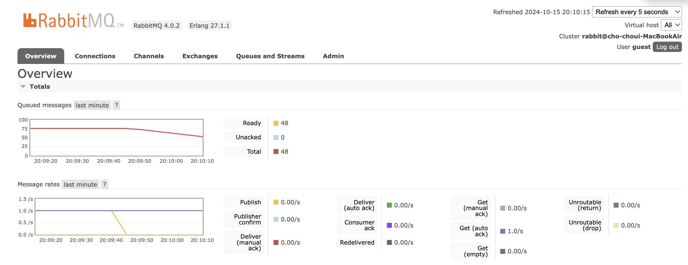

# A. What
rabbitmq(message queue) experiments

- 구조 
  - producer -> router(direct/fanout/topic/header exchange) queue -> consumer

# B. How to run?

1. build pom.xml
2. run sync/BrokerConfigurationApplication (queue)
3. run sync/producer (producer)
4. run sync/consumer (consumer)
5. http://localhost:15672
	- id: guest
	- pw: guest

1. Publish: 1 ops/s
2. Get(auto ack): 1 ops/s

## b-1. Listening ports

| Protocol   | Bound to | Port  |
|------------|----------|-------|
| amqp       | 127.0.0.1| 5672  |
| clustering | ::       | 25672 |
| http       | ::       | 15672 |
| mqtt       | ::       | 1883  |
| stomp      | ::       | 61613 |
| stream     | ::       | 5552  |

# C. sync vs async

sync가
1. 구현 쉽고
2. 에러 디버깅 더 직관적이고,
3. 메시지 order 잡기 쉬움

async가
1. high throughput에 더 유리함
2. loosely connected, distributed system에 더 유리
3. network latency에 영향을 덜 받음(안기다려도 되니까)

# D. router(exchange)
## d-1. types
exchange: producer에서 받은 message를 queue로 라우팅 해주는 애

1. Direct Exchange
2. Fanout Exchange
3. Topic Exchange
4. Headers Exchange

## d-2. confirms
producer -> exchange(router) 보낸거 성공하면 ack=true 뜸\
문제는, exchange -> queue 보낼 때 실패하면 producer가 알 방법이 없잖음?\
그걸 알려주는게 confirm 

confirm file's three scenarios:
- case1) 메시지를 올바른 queue에 올바른 router(default exchange "")에 보내는 것
- case2) 메시지를 wrong queue에 올바른 default router(exchange)인 ""로 보내는 것
- case3) 메시지를 올바른 queue로 보내는데 exchange(router)를 이상한 곳으로 보내는 코드 (nack received)

흥미로운건 case2인데,\
producer -> exchange 까진 잘 갔으니까 ack=true 뜨는데,\
exchange -> queue 실패한걸\
confirm이 알려줌 

# E. Error
메시지 에러처리 하는 custom handler 등록하는 방법  

NOTE: Such a simple handler is not generally needed since the framework will log the failed message itself; for a real
application, some additional action might be taken, for example write the bad message to a database.

