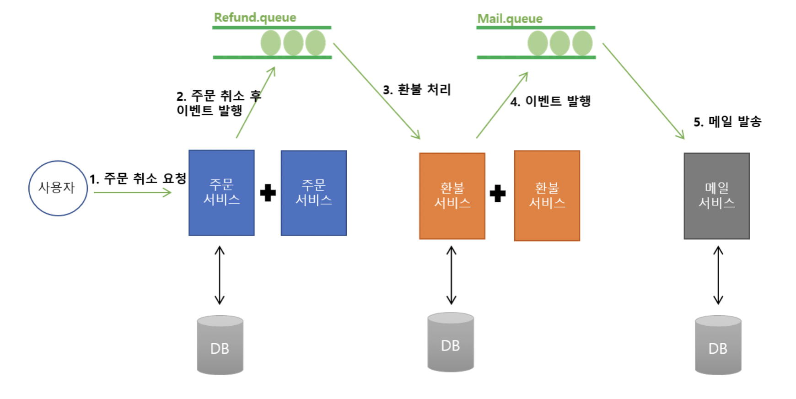

# A. architecture

1. 주문(order) 서비스 중 환불 받으면, 환불 다 끝날 때 까지 client가 기다리는게 아니라, 'refund queue'에 요청 넣고 바로 끝냄.
2. refund 서버는 환불 처리하고 결과값을 메일 서비스로 메시지를 보냄
3. 메일 서비스는 환불이 됬는지 안됬는지 결과값을 유저에게 메시지 발송함

# B. how to run?

1. docker-compose up -d (docker run -d --name rabbitmq -p 5672:5672 -p 15672:15672 --restart=unless-stopped rabbitmq:management 이것도 가능한데 id/pw: guest)
2. http://localhost:15672/   id:admin pw:admin
3. run order/
   1. RabbitConfiguration에서 refund queue 생성.
   2. http://localhost:15672/ 에 Queues에 refund.queue가 생긴걸 확인
4. run refund/ 
   1. RabbitConfiguration에서 mail queue 생성
   2. http://localhost:15672/ 에 Queues에 mail.queue가 생긴걸 확인
5. run mail/

주의! 이 서순으로 프로젝트 실행 안하면, queue가 안만들어졌다는 에러 나옴!

# Q. 왜 event driven으로 만듬?

## 1. 문제점
기존 order + refund가 짬뽕되어 있을 땐 ([기존 프로젝트 링크](https://www.blindhire.co.kr/))

1. order 코드 + refund 코드가 강결합 + 섞여있음 -> 유지보수 어려움
2. order 중 refund 하다 장애 발생하면?
   1. transaction 처리되는데, 이 때 refund만 취소되는게 아니라 order까지 취소됨.
   2. 만약 order 후 refund했는데, refund 서버가 터져있으면? -> 클라이언트는 무한 대기해야함.
   3. 게다가 refund order가 유실되기 까지 함. 

## 2. 해결책
만약 event-driven으로 처리하면?

1. refund 서버가 터져있어도, order는 바로 끝나고, 
2. message queue에 refund 요청이 남아있어서, 요청이 유실되지 않음.
3. refund에 트랜젝션이 refund선에서 끝남. order까지 가지 않음.

