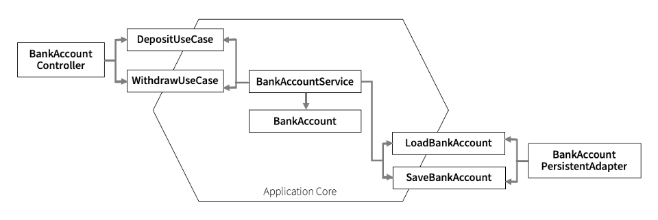
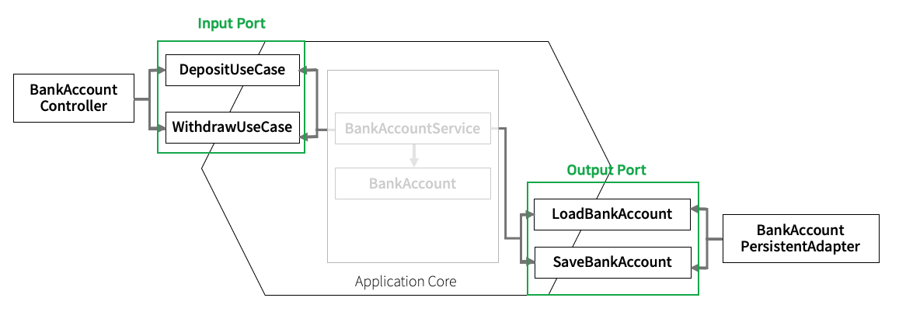
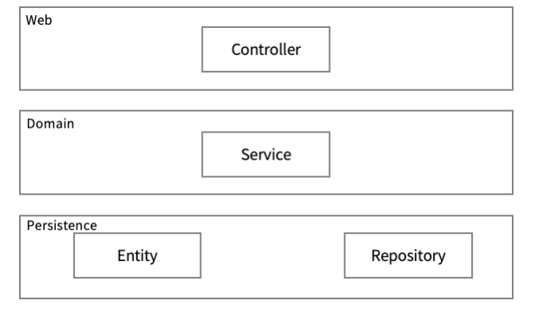
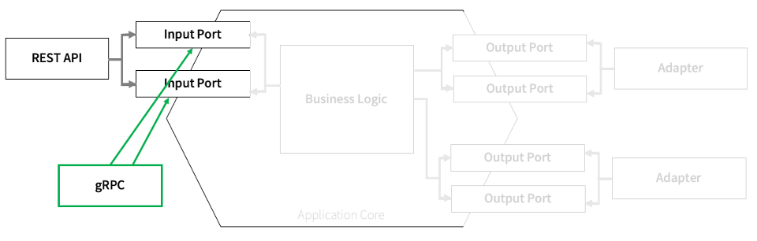

---\
Index

A. hexagonal architecture\
B. 도메인을 어떤식으로 관리하지?\
C. domain이랑 @Entity랑 따로 관리하네?\
D. controller에서 들어올 때\
E. 장점

---\
A. hexagonal architecture

의존성이 외부 웹/persistence -> service -> domain 으로 의존한다.

Q. domain안에 deposit(), withdraw()를 구현했나?

hexagonal 내부에는 port를 통해서 밖에 접근할 수 없다.

전체적으로 이런 구조.

---\
B. 도메인을 어떤식으로 관리하지?

도메인에 deposit(), withdraw()가 있네?\
근데 이건 그냥 객체에 값을 저장하는 거잖아?

account.deposit(10000L);\
service.deposit(account); 하는건가?

아닌데, void deposit(Long id, BigDecimal amount); 라잖아.

그럼,
account.deposit(10000L);\
service.deposit(account.getId(), request.getAmount());

이런식으로 하나?

domain에 business logic이 있는데, 얘랑 서비스랑 어떻게 싱크 맞추지?

진짜 account.deposit(10000L);\
service.deposit(account); 로 하네?

repository 도착 전에, 중간단계인 adapter에서 domain -> Entity로 변경 후, 저장하네?
그리고 다시 persistence layer에서 service layer로 반환할 때에는, Entity->domain 바꿔서 반환하네?
@Entity는 철저하게 persistence layer에서만 노는건가?

---\
C. domain이랑 @Entity랑 따로 관리하네?

Bank랑 BankEntity랑 따로 노네?
domain에는 비즈니스 로직이 있는데, BankEntity는 getter/setter, @Entity, @Id 밖에 없음.

Mapper가 있어서, BankEntity <-> Bank 변환시켜주네?

---\
D. controller에서 들어올 때

이 때도, port.in 타고 들어오네?
port.in에 있는 인터페이스를 service가 implement하여 메서드로 구현하고,
port.out에 있는 인터페이스를 service가 @Autowired로 주입받아 repository를 쓰네?

---\
E. 장점

패키지 구조를 목적에 맞게 명확히 구분지었기 때문에,
모든 패키지 다 파악할 필요 없이, 필요한 패키지만 까보면 됨.

REST API로 응답하는 송금 시스템에 외부 위험 감시를 위하여 보안 서버로 통신해야 하는 요구사항이 생겨 gRPC 프로토콜을 이용하여 입출금 기록을 보내야 한다는 시나리오를 가정해봅시다. 애플리케이션 코어 수정하거나 거대한 은행 시스템을 파악할 필요 없이 인풋 포트에서 제공하는 인터페이스를 이용하여 입출금 정보를 가져오면 될 것입니다.

