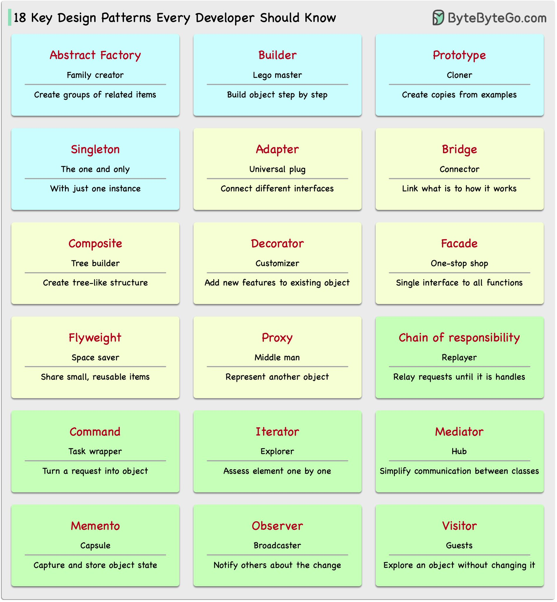
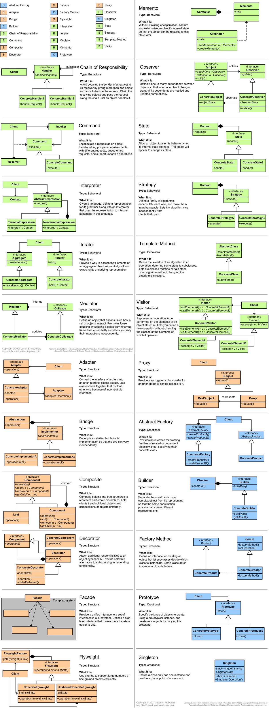

---\
objective

modularize concepts of design pattern

---\
todo

1. modularize -- clear
	- build MVP from scratch,
	- to understand the core concepts with minimum comment,
	- so that I can pick up quick and apply easily to make organism/template/page
2. indexing -- clear
	- summarize each pattern into single line
3. analyze
	- compare each pattern to analyze which pattern specializes in certain context
	- correcting my thoughts reading design pattern gang of four
4. experiment
	- what if? (hypothesis -> correction)

---\
indexing

A. Creational: 객체 생성 관련

1. factory : 부모 클래스에서 객체 인터페이스 정의, 자식 클래스에서 인스턴스 생성
2. abstract factory : implements로 비슷한 객체 묶어서 여러 팩토리 동시 가동.
3. static factory : '생성자에 static' 써서 생성자 이름 변경, default parameter, 생성자 안 로직, singleton 가능.
4. builder : 파라미터 여럿 달린 생성자 가진 객체를 하나씩 '조립'
5. singleton : 인스턴스 딱 '하나'만 생성됨. 멀티 쓰레드 처리해줘야 함.
6. prototype : 객체 생성 비용이 많이들 경우, '복사'해서 인스턴스로 만듬. 단, 복사 메서드는 내가 직접 짜야함. <vs flyweight> 프로토타입은 복사, 플라이웨잇은 중복제거+공유

B. Structural: 프로그램 구조 관련

1. decorator : 레고마냥 모듈화 시켜놓고 필요하면 new A(new B(new C())); 이런식으로 사용.
2. adapter : 두개 시스템 인터페이스 충돌할 때, 한 시스템의 인터페이스를 다른 시스템 인터페이스로 호환해주는 것. 110V -> 220V
3. composite : composite 클래스가 탐색기 폴더구조(tree)의 root가 되어 재귀로 돌면서 일괄관리.
4. facade : 잡다한 모듈 많을 때, 통합 인터페이스 클래스 하나에 (큰 벽 안에) 넣고 facade가 출입구에서 심플하게 통합 관리하는 것. <vs mediator> 밖에선 facade안에 객체 안씀. 단방향 통신.
5. proxy : aop, used for sniffing.
6. bridge : 최상위 추상 클래스가 여러 api implements 받아 씀. (ex. GUI layer에 외부 business layer module 붙일 때 호환성 맞추려고 사용)
7. flyweight : 동일한 것은 공유해서 메모리 낭비 없애는 패턴. <vs prototype> 프로토타입은 복사, 플라이웨잇은 중복제거+공유

C. Behavioral: 객체들의 상호작용 패턴

1. observer : 등록된 객체 상태가 변화하면, 옵저버한테 알려준다.
2. state : 객체의 상태를 클래스화
3. strategy : behavior을 클래스화해서 전략적이게 원하는 행동을 DI로 주입해 사용. <vs command> same purpose but different approach. (ex. bubble sort, merge sort, ...)
4. command : behavior을 클래스화해서 전략적이게 원하는 행동을 DI로 주입해 사용. <vs strategy> different purpose. (ex. cut command, copy command, sort command, ...)
5. template : 주어진 템플릿에 알맹이 몇개만 쏙 바꿈
6. visitor : 파일 시스템(tree)을 dfs || bfs tree traversal로 돌면서 연산. <vs iterator> 얜 tree traversal(dfs || bfs)
7. chain of responsibility : try~catch { 사원 -> 매니저 -> 사장 } 책임 전가. throws Exception.
8. iterator : avail for loop for user-defined-object. ex) .hasNext(), .next()  <vs visitor> 얜 특정 단일 객체의 필드에 대해 for loop
9. mediator : 컴포넌트끼리 완전 분리된 상황에서 중간에 중재자 한명이 컨트롤. 그래프 복잡도 -> 모든 컴포넌트의 에지가 중재자로 연결되어 통합관리. <vs facade> facade는 대놓고 철권통치라 밖에서 facade만 쓰는데, 중재자는 컴포넌트의 인터페이스 통합이 목적. 안에 컴포넌트도 개별로 씀. 양방향 통신.
10. memento : 객체의 과거 상태 저장해 undo하거나 공유해야할 때.
11. null object : return null하면 깨지니까 return custom-null-object하는 것.
12. interpreter : 컴파일러 인터프리터 만들 때 사용.

---\
credit

1. headfirst design pattern
2. https://github.dev/bethrobson/Head-First-Design-Patterns/tree/master/src/headfirst/designpatterns
3. https://beomseok95.tistory.com/category/DesignPattern
4. https://www.tutorialspoint.com/design_pattern/index.htm
5. https://twitter.com/alexxubyte/status/1650888663960805376
