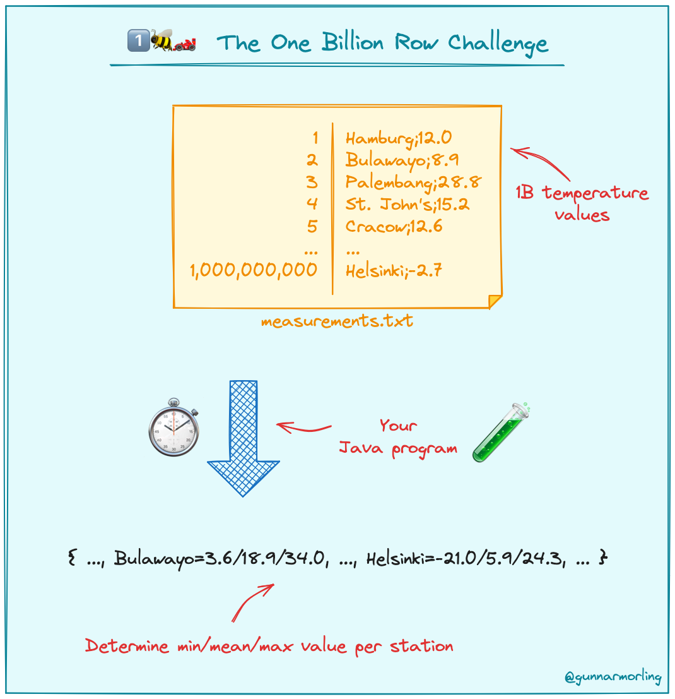

# A. What



measurements.txt 파일이 10억개의 rows가 있다.

1. 최대한 빠른 시간 안에 전부 읽어서 
2. 각 city당 min/mean/max 를 정리하고 
3. 출력하자


```
head measurements.txt

Boise;2.5
Barcelona;18.3
Ouahigouya;47.1
Parakou;29.7
Vilnius;-0.2
Monaco;15.4
Dikson;-17.2
Cape Town;12.4
Jerusalem;18.4
Palm Springs;20.0
```

# B. Index
- step1. 3분 22초
  - jdk17
- step2. 1분 35초
   - openjdk21
   - parallel 
- step3. 35초
  - jdk21 GraalVM
  - parallel, but read files in 10MB chunks using FileChannel library
  - `final byte[] buffer = new byte[128];` 로 값 옮길 때 재활용
- step4. 23초
   - jdk21 GraalVM
   - parallel, but read files in 1MB chunks using FileChannel library

# C. How

## a. 실험 환경
1. 1brc's 실험환경
   - eight cores of a Hetzner AX161 dedicated server (32 core AMD EPYC™ 7502P (Zen2), 128 GB RAM).
2. my pc
   - arm64, 1 CPU, 8 core, 16GiB RAM

## b. how to change jdk using asdf?

```
asdf current
asdf list java
asdf local java ${java-version}
```

## c. how to download 1 billion rows in .txt?

```
cd step00-create-txt-with-massive-rows/
javac CreateMeasurements.java
java CreateMeasurements
```

## d. how to run?
```
javac CalculateAverage.java
time java CalculateAverage
```

## e. how to interpret 'time' command's outcome?

```
ex) java CalculateAverage  191.55s user 5.38s system 99% cpu 3:17.40 total
```
1. CalculateAverage:
    - 실행한 자바 클래스 이름
2. 191.55s user:
    - amount of CPU time spent in user-mode.
    - This does not include time spent doing system-level tasks or waiting for I/O operations
    - A higher value here means your program spent a lot of time performing calculations or processing data.
3. 5.38s system:
    - This is the amount of CPU time spent in the kernel (system-mode) within the context of this process
    - It indicates the time the operating system kernel spent performing tasks on behalf of the program, such as handling file I/O, network communications, or other system calls
    - A lower value here typically means your program did not require the system to do a lot of work on its behalf
4. 99% cpu:
    - CPU usage
5. 3:17.40 total
    - elapsed real time from start to finish of the command you ran

   
# D. Details

## step01 - Collector

### 0. idea
1. jdk17
2. Collections.collector 로 1 billion rows의 min/mean/max 계산을 빨리 해보자.


#### 0-1. collector
The collector has four components.
1. supplier
2. accumulator
3. combiner 
4. finisher

The main purpose of the collector is to 
1. collect a stream of data from each row, 
2. calculate the required values, 
3. combine results from different threads, 
4. and finally convert the accumulation into the desired output format.


```java
Collector<Measurement, MeasurementAggregator, ResultRow> collector = Collector.of(
    MeasurementAggregator::new,
    (a, m) -> {
        a.min = Math.min(a.min, m.value);
        a.max = Math.max(a.max, m.value);
        a.sum += m.value;
        a.count++;
    },
    (agg1, agg2) -> {
        var res = new MeasurementAggregator();
        res.min = Math.min(agg1.min, agg2.min);
        res.max = Math.max(agg1.max, agg2.max);
        res.sum = agg1.sum + agg2.sum;
        res.count = agg1.count + agg2.count;
        
        return res;
    },
    agg -> {
        return new ResultRow(agg.min, agg.sum / agg.count, agg.max);
    });

Map<String, ResultRow> measurements = new TreeMap<>(Files.lines(Paths.get(FILE))
    .map(l -> new Measurement(l.split(";")))
    .collect(groupingBy(m -> m.station(), collector)));
```

### 1. jdk17: 3분 22초

```
195.28s user
5.10s system
98% cpu
3:22.42 total
```
- 혹시나 해서 jdk8 버전도 테스트 해봤는데, jdk17버전과 성능상 비슷하다.


-----------------------------------------------
## step02 - process lines in parallel

### 0. idea

파일 읽는걸 병렬처리 해보자

step1 code는 single core에서만 도는데,\
이 방식은 여러 코어에서 병렬로 돔

```java
Map<String, Measurement> resultMap = Files.lines(Path.of(FILE)).parallel()
```
...을 사용한 방법

#### 0-1. .parallel().groupBy(groupingByConcurrent());
```java
Map<String, Measurement> resultMap = Files.lines(Path.of(FILE)).parallel() //병렬로 읽기
    .map(record -> {
        // Map to <String,double>
        int pivot = record.indexOf(";");
        String key = record.substring(0, pivot);
        double measured = Double.parseDouble(record.substring(pivot + 1));
        return new AbstractMap.SimpleEntry<>(key, measured);
    })
    .collect(Collectors.toConcurrentMap(
        // Combine/reduce:
        AbstractMap.SimpleEntry::getKey,
        entry -> new Measurement(entry.getValue()),
        Measurement::combineWith));
```


### 1. jdk17: 1분 44초
```
300.36s user
29.69s system
316% cpu
1:44.34 total
```

- 병렬 프로그래밍 썼더니, user space에서 소요시간이 150% 늘었고,
- 커널모드에서 file i/o에 쓰는 시간도 600% 늘었는데,
- 총 소요시간은 1분 38초나 줄었다.

단, 316% CPU usage까지 올라가는걸 보면, 오래하다간 쓰로틀링 엄청 걸릴 듯 하다.


### 2. openjdk21: 1분 35초
```
412.60s user
29.51s system
464% cpu
1:35.21 total
```
jdk21의 .parallel()이 jdk17보다 더 최적화가 잘되있거나,
jdk21에 experimental 기능중에 하나인 경량 쓰레드인 fibers가 .parallel() 수행시 생기는 concurrency overhead 비용을 줄여줘서 성능개선이 된 듯 하다.

CPU 사용량만 봐도, 150%나 높은걸 보면, 수 많은 경량 쓰레드인 fibers가 CPU를 동시에 점유하려고 하기 때문에 저렇게 높히 올라간 것으로 보인다.


---
## step03 - parallel, but read files in 10MB chunks

### 0. idea
#### 0-1. parallel()
파일을 여러 코어에서 병렬로 읽는다

#### 0-2. 10MB chunk씩 끊어 읽기
NIO의 FileChannel을 파일 전체를 한번에 읽는게 아니라, 10MB단위로 끊어서 parallel()로 여러 코어들이 읽으면 빨라진다. 

#### 0-3. MappedByteBuffer로 memory de-allocation 없이 덮어쓰면서 재사용하기 
파일을 10MB chunk 단위로 끊어 읽을 때,
MappedByteBuffer 단위로 읽고,

```
final byte[] buffer = new byte[128];
```
여기에 필요한 값을 담아서 쓴다.

그것이 city's name이던, Double 값이던.


### 1. jdk17: 2분 17초
```
130.87s user
6.61s system
99% cpu
2:17.50 total
```

- 여태까지는 java.nio.file.Files 라이브러리를 썼는데, 그와 더불어 java.nio.channel 라이브러리를 썼더니 성능향상이 있었다.
- 그런데 fibers 전용인지 jdk21과 압도적인 성능차이가 난다.


### 2. openjdk21: 44초
```
159.59s user
16.36s system
397% cpu
44.293 total
```

경량 쓰레드를 쓸 때마다 CPU 점유율이 미친듯이 오르는 단점과는 별개로, 성능 차이 또한 미친듯이 많이 난다.


-----------------------------------------------
## step04 - parallel, but read files in 1MB chunks

### 0. idea
step3과 차이점은, 10MB chunk -> 1MB chunk로 바뀐 것과, Double을 int처럼 처리한 것 두가지다.


1. parallel
   - [160.5 -> 18]
2. 10MB로 파일을 끊어서 병렬처리하다가, 1MB 단위로 끊어 읽으니 성능이 유의미하게 개선되었다!
    - 전체 파일을 한번에 parallel로 읽는게 아니라, manageable chunks로 나눠서 읽으면, memory overload를 피할 수 있다.
    - parallel processing techniques 중 하나라고 한다.
    - local pc 기준, 아래 두 테크닉 포함해서 12초 시간개선이 되었다.
3. memory de-allocation 피하기
    - [18 -> 6.5]
   - city이름을 옮길 때, `byte[] nameBuffer`를 쓰는데, 딱 필요한 길이의 bytecode size만 length로 빼고 new String(byte[], 0, length);로 써서, memory de-allocation step을 스킵할 수 있었다.   
4. 12.3에서 Double 값이 소숫점 한자리인데, 메모리 저장할 땐 int type에 123로 저장하고, 맨 마지막에 min,max,mean 계산할 때만 /10 해서 Double type으로 변환하는 방식
    - Double type은 소숫점 처리하는 계산 때문에 CPU단에서 int type 숫자 처리보다 느리다.


### 1. jdk17: 30초
```
80.37s user
13.37s system
308% cpu
30.356 total
```

### 2. openjdk21: 27초
```
73.73s user
14.26s system
319% cpu
27.560 total
```

### 3. jdk21 GraalVM: 23초
```
53.33s user
11.77s system
272% cpu
23.853 total
```


-----------------------------------------------
# F. Resources

1. https://github.com/gunnarmorling/1brc?tab=readme-ov-file
2. https://tivrfoa.github.io/java/benchmark/performance/2024/02/05/1BRC-Timeline.html
