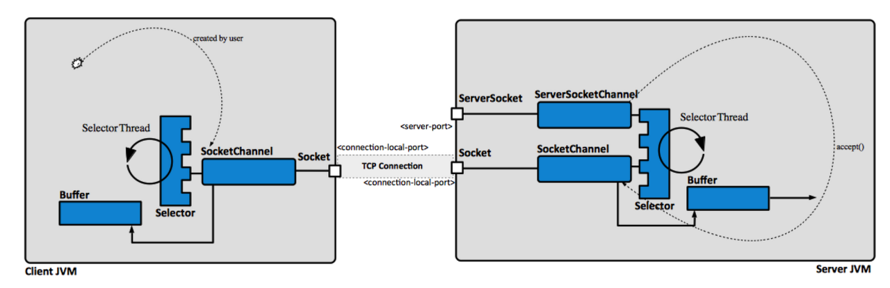

# step3. chat using NIO

## architecture

- server
	1. 서버 소켓인데 non-blocking으로 설정함
	2. Selector를 event listener 삼아 서버 소켓의 "OP_ACCEPT", "OP_READ" 요청이 오는지 모니터링
	3. 1024 byte 할당된 ByteBuffer에 클라이언트와 연결된 SocketChannel에서 받은 byte[]를 담아 출력
- client
	1. client의 main thread는 채팅 입력 받아 ByteBuffer[1024]에 담아 서버와 연결된 SocketChannel에 보내는 역할
	2. client의 새롭게 생성된 쓰레드는 Selector을 만들어 서버에서 오는 "OP_READ"를 모니터링 함.

## 사용 라이브러리

1. java.net.ServerSocket
2. java.nio.channels.SocketChannel
3. java.nio.channels.Selector
4. java.nio.ByteBuffer

## 사용 객체

1. SocketChannel
2. Selector
3. ByteBuffer

## resources

https://code-run.tistory.com/78
